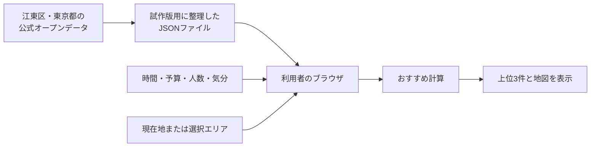

# いまスポ — 江東区スポーツマップ

「運動したい」を「今からできる」に変える、都知事杯オープンデータ・ハッカソン向けのWebアプリです。

時間・予算・人数・気分・屋内／屋外の希望を選ぶと、江東区でできる運動を最大3件提案します。運動施設だけでなく、給水スポット、クーリングシェルター（涼み処）、公衆トイレ、AEDも同じ地図で確認できます。

現在の動作版はこちらです。

- [いまスポを開く](https://imaspo-koto-sports-map.balmy-shark-4539.chatgpt.site)
- 現在の公開先は試作確認用です。閲覧環境によってはサインインが必要です。
- このサービスは東京都・江東区の公式サービスではありません。

---

## 最初に、この3つだけ分かれば大丈夫

開発経験がほとんどない人は、ひとまず次の3点を押さえればOKです。

1. **何をするアプリ？**
   その人の「今の条件」に合う運動を3つ提案し、場所と料金の目安を地図で見せるアプリです。

2. **どこのデータを使っている？**
   江東区と東京都が公開しているオープンデータを、試作版向けに整理して使っています。

3. **バックエンドはある？**
   現在の中心機能には、専用のバックエンドやデータベースを使っていません。施設データはJSONファイルとして置き、おすすめ計算は利用者のブラウザ内で行います。

「JSONって何？」「ブラウザ内で計算ってどういうこと？」という人向けの説明も、このREADMEの後半にあります。

---

## 目次

- [このアプリが解決したいこと](#このアプリが解決したいこと)
- [ひとことで言うと](#ひとことで言うと)
- [なぜ江東区なのか](#なぜ江東区なのか)
- [現在できること](#現在できること)
- [現在できないこと](#現在できないこと)
- [利用者から見た使い方](#利用者から見た使い方)
- [アプリの仕組み](#アプリの仕組み)
- [バックエンドがなくても動く理由](#バックエンドがなくても動く理由)
- [使用している技術](#使用している技術)
- [フォルダとファイルの案内](#フォルダとファイルの案内)
- [自分のパソコンで動かす方法](#自分のパソコンで動かす方法)
- [よく使うコマンド](#よく使うコマンド)
- [おすすめ提案の仕組み](#おすすめ提案の仕組み)
- [データについて](#データについて)
- [施設データを追加・更新する方法](#施設データを追加更新する方法)
- [画面や文章を変更する方法](#画面や文章を変更する方法)
- [テストと確認](#テストと確認)
- [Gitを使うときの基本](#gitを使うときの基本)
- [チームで作業するときのコツ](#チームで作業するときのコツ)
- [ハッカソンでのデモ方法](#ハッカソンでのデモ方法)
- [よくあるトラブル](#よくあるトラブル)
- [今後追加できそうな機能](#今後追加できそうな機能)
- [用語集](#用語集)

---

## このアプリが解決したいこと

運動したいと思っても、実際に始めるまでには小さなハードルがたくさんあります。

- 近くで何ができるのか分からない
- 自分の空き時間で間に合うか分からない
- 料金がいくらか分からない
- 1人や少人数でも使えるのか分からない
- 暑い日に休める場所や給水場所が分からない
- 施設を一つずつ検索するのが面倒

情報自体は行政や施設のWebサイトにあっても、複数のページに分かれていると、探しているうちに運動する気が消えてしまいます。ゲームならクエスト受注前にメニューが多すぎて離脱するやつです。

そこで「いまスポ」では、利用者の今の状況を先に聞き、その条件に合いそうな候補を3つまでに絞ります。

### 想定している利用者

- 江東区に住んでいる人
- 江東区へ通勤・通学している人
- 江東区へ遊びに来た人
- 「少し体を動かしたいけど、何をするかは決まっていない」という人
- 行政の施設情報を一つずつ調べるのが大変だと感じる人

### 利用者に起こしたい変化

```text
運動したいけど、どうしよう
        ↓
今の時間・予算・人数なら、この3つができそう
        ↓
場所・料金・注意事項を確認する
        ↓
公式情報を確認して、実際に出かける
```

このアプリだけで予約まで完結させるのではなく、**「候補が決まらない状態」から「次に確認する施設が決まった状態」へ進めること**を目標にしています。

---

## ひとことで言うと

> 今の条件から、近くでできる運動を3つ提案し、給水や涼み処まで一緒に探せるスポーツマップ。

発表や説明のときは、まずこの一文を使う想定です。

もう少し短くする場合は、次の言い方も使えます。

> 「運動したい」を「今からできる」に変える地図アプリ。

---

## なぜ江東区なのか

現在の「いまスポ」は、江東区を**パイロット地域**にしています。

パイロット地域とは、本格的に広い地域へ展開する前に、小さな範囲で使い勝手やデータ品質を確かめる最初の地域です。テレビ番組のパイロット版や、ゲームの先行テストに近い考え方です。

江東区を選んだ主な理由は次のとおりです。

- スポーツ施設のオープンデータがある
- クーリングシェルターのオープンデータがある
- 公衆トイレとAEDのオープンデータがある
- 東京都水道局の給水スポットと組み合わせられる
- 屋内施設、屋外施設、水辺、競技場など、運動の選択肢が多い
- 最初から東京都全域を扱うより、データの間違いや不足を確認しやすい

「江東区だけで終わる」という意味ではありません。江東区でうまくいく形を作ってから、他の区市町村へ広げる想定です。

---

## 現在できること

### 1. 条件から運動を最大3件提案する

利用者は次の条件を選べます。

- 使える時間：30分、60分、90分、120分
- 1人あたりの予算：無料、500円、1,000円、3,000円
- 人数：1人、2人、4人、10人
- 場所：屋内、屋外、どちらでも
- 気分：ゆるく、気分転換、しっかり、わいわい

条件に合わないことが明確な候補は外し、残った候補を距離などで採点して、上位3件を表示します。

### 2. 現在地またはエリアを基準に探す

- ブラウザの位置情報を許可した場合は、現在地を距離計算に使います。
- 許可しない場合でも、江東区の中心、亀戸、豊洲・有明、東砂、夢の島から選べます。
- 位置情報は自動では要求せず、「現在地を使う」を押したときだけブラウザが確認します。

### 3. 地図で場所を確認する

- 運動施設を地図に表示します。
- おすすめ上位3件には番号を付けます。
- 給水スポット、涼み処、公衆トイレ、AEDの表示を切り替えられます。
- おすすめカードの「地図で見る」を押すと、その施設へ地図が移動します。

### 4. 料金や注意事項を確認する

- 確認できた一般料金を表示します。
- 料金の確認日を表示します。
- 団体料金しか分からない場合などは、無理に1人分を計算せず「要確認」にします。
- 公式施設ページへのリンクを表示します。
- 予約、個人利用枠、臨時休館などの注意を表示します。

### 5. 安全を支える場所を確認する

- 給水スポット
- クーリングシェルター（暑いときに涼める場所）
- 公衆トイレ
- AED

ただし、開館時間、臨時休館、故障、満員などはリアルタイムではありません。利用前の公式確認が前提です。

---

## 現在できないこと

試作版なので、次の機能はまだありません。

- 施設のリアルタイム空き状況の取得
- 施設予約
- リアルタイム混雑表示
- ログイン
- お気に入りの保存
- 運動仲間のマッチング
- 利用者による口コミや投稿
- 管理画面からのデータ更新
- 東京都全域の施設検索
- 自動販売機の正確な位置表示
- 現在の暑さ指数（WBGT）の自動取得
- ルート検索や徒歩時間の正確な計算

### なぜ自動販売機を表示していないのか

都内の自動販売機を、位置・価格・稼働状態までまとめた信頼できるオープンデータが見つかっていないためです。

存在しないデータを推測で表示すると、現地に行ったときに自動販売機がない、利用できない、といった問題が起きます。そのため、現在は公式データがある**給水スポット**を表示しています。

### なぜ空き状況を表示していないのか

施設ごとに予約システムが異なり、東京都内で統一されたリアルタイムのオープンデータがないためです。現在は公式サイトへのリンクを表示し、最後の確認を利用者にお願いしています。

「できないことを無理にできるように見せない」のも、この試作版で大切にしている方針です。

---

## 利用者から見た使い方

### 基本の流れ

1. サイトを開く
2. 「場所を変える」から現在地またはエリアを選ぶ
3. 使える時間を選ぶ
4. 予算を選ぶ
5. 人数を選ぶ
6. 屋内／屋外の希望を選ぶ
7. 今の気分を選ぶ
8. 「この条件で3つ提案してもらう」を押す
9. おすすめカードを確認する
10. 「地図で見る」または「公式情報を見る」を押す

### 現在地を使いたくない場合

位置情報を許可しなくても利用できます。「場所を変える」を押して、エリアを選んでください。

### 施設へ行く前に確認すること

- 今日、個人利用できるか
- 予約が必要か
- 料金が変わっていないか
- 必要な用具や服装があるか
- 休館日ではないか
- 暑さや自分の体調に問題がないか

「いまスポ」は候補探しを助けるアプリであり、当日の利用を保証するアプリではありません。

---

## アプリの仕組み

難しそうに見えますが、中心の流れはかなりシンプルです。



もう少し具体的に書くと、次の順番です。

1. 江東区や東京都の公開データから、施設名、住所、緯度・経度などを確認します。
2. アプリで扱いやすい形に整理し、`public/data` 内のJSONファイルへ保存します。
3. 利用者がページを開くと、ブラウザがJSONファイルを読み込みます。
4. 利用者が選んだ条件と、施設データをブラウザ内で比較します。
5. 条件に合う候補を採点し、上位3件を表示します。
6. LeafletがOpenStreetMapの地図上へマーカーを表示します。

---

## バックエンドがなくても動く理由

### 現在の答え

現在の中心機能には、**自分たちで作る専用バックエンドやデータベースは必要ありません**。

施設データは、サーバー上のデータベースではなく、JSONファイルとしてサイトと一緒に配っています。おすすめ計算も、利用者のブラウザ内で行います。

たとえるなら、次の違いです。

- 今の方式：完成した商品を棚に並べ、利用者が自分で選ぶ小さなお店
- バックエンド方式：注文を受けて、奥の厨房や倉庫へ問い合わせて結果を返すお店

「いまスポ」は今のところ、毎回厨房へ問い合わせなくても動く内容です。

### まったくサーバーが存在しないわけではない

Webサイトのファイルを利用者へ届けるため、Cloudflare側の配信サーバーは使っています。また、現在の構成ではvinextがページを配信できる形にビルドします。

正確には、次の表現が近いです。

> 配信の仕組みはあるが、施設検索専用のAPI、専用データベース、管理サーバーはまだない。

### 現在地の扱い

- アプリはGPSの値を自分たちのデータベースへ保存しません。
- おすすめの距離計算はブラウザ内で行います。
- アプリ独自のアクセス履歴や位置履歴も保存していません。
- 地図を表示するため、OpenStreetMapのタイル画像を取得する通常の通信は発生します。

### バックエンドが欲しくなる機能

次の機能を追加する段階では、バックエンドやデータベースを検討します。

- ログイン
- お気に入り保存
- マッチング
- 口コミ投稿
- 管理画面
- 管理者による即時データ更新
- リアルタイム予約・混雑情報
- 秘密のAPIキーが必要な外部サービス連携

最初からバックエンドを作らないことで、開発量、運用費、個人情報管理、セキュリティ対応を小さくできます。ハッカソンのMVPとしては、この軽さがかなり強いです。

---

## 使用している技術

技術名だけ見ても分かりにくいので、「何を担当しているか」とセットで説明します。

| 技術 | このアプリでの担当 | 初心者向けの説明 |
|---|---|---|
| HTML / CSS | 文章、ボタン、レイアウト、色 | Webページの骨組みと見た目 |
| React | 条件選択、表示切り替え、カード更新 | 画面を部品に分け、操作に応じて更新する仕組み |
| TypeScript | データや関数の間違いを減らす | JavaScriptに「この値は数字」などのルールを足したもの |
| Vite | 開発中の起動とビルド | 変更を素早く画面へ反映する道具 |
| vinext | ReactのページをVite・Cloudflareで動かす | 今のプロジェクト全体を動かす土台 |
| Leaflet | 地図とマーカー | 地図を操作しやすくするライブラリ |
| OpenStreetMap | 地図画像と地図情報 | みんなで作るオープンな地図 |
| JSON | 施設データの保存 | 項目名と値をセットで書けるテキストファイル |
| Cloudflare / Sites | 公開と配信 | 作ったサイトをインターネットへ届ける場所 |
| ESLint | コードのチェック | よくある書き間違いや危ない書き方を見つける道具 |
| Node.js / npm | 開発ツールとライブラリの実行 | パソコン上でWeb開発用の道具を動かす環境 |

### Reactを使う理由

条件ボタン、地図、候補カードなど、利用者の操作で画面が変わる部分が多いためです。単純なHTMLだけでも作れますが、状態の管理が複雑になりやすいためReactを使っています。

### TypeScriptを使う理由

たとえば料金に文字列を入れたり、緯度と経度の項目名を間違えたりすると、地図や推薦が壊れます。TypeScriptは、そうした間違いを実行前に見つけやすくします。

### Leafletを使う理由

比較的軽く、地図表示、マーカー、ポップアップ、ズームなどを実装しやすいためです。現在はReact専用の地図ライブラリを追加せず、Leafletを直接使っています。

### 静的JSONを使う理由

今回の件数なら、データベースを用意するより簡単だからです。

良いところは次のとおりです。

- ファイルを見れば内容が分かる
- 特別なサーバーがいらない
- 運用費を抑えやすい
- バックアップしやすい
- Gitで変更履歴を確認できる

弱いところもあります。

- 更新のたびにファイル修正と再公開が必要
- 多人数で同時編集しにくい
- 数万件、数十万件になると扱いにくい
- リアルタイム更新に向かない
- 管理画面から更新できない

初期版には向いていますが、将来の全都展開ではデータ更新方法を見直す可能性があります。

---

## フォルダとファイルの案内

最初からすべて理解しなくても大丈夫です。よく触る場所には「よく触る」と書いてあります。

```text
Sports-Map/
├─ app/
│  ├─ page.tsx                 ページの入口
│  ├─ SportsMapApp.tsx         画面と操作の中心（よく触る）
│  ├─ globals.css              色・余白・スマホ表示など（よく触る）
│  ├─ layout.tsx               ページタイトルやSNS画像
│  └─ lib/
│     ├─ recommend.ts          おすすめ計算（ロジック担当が触る）
│     └─ types.ts              データ項目の型・ルール
├─ public/
│  ├─ data/
│  │  ├─ activities.json       運動候補8件（データ担当が触る）
│  │  ├─ support-spots.json    給水・涼み処・トイレ・AED 10件
│  │  └─ ATTRIBUTION.md        データ出典と利用条件
│  ├─ favicon.svg              ブラウザのタブに出る小さなアイコン
│  └─ og-sports-map.jpg        SNSなどで共有したときの画像
├─ tests/
│  └─ rendered-html.test.mjs   最低限の自動テスト
├─ .openai/
│  └─ hosting.json             公開先の設定。むやみに変更しない
├─ package.json                使用ライブラリとコマンドの一覧
├─ package-lock.json           ライブラリの正確なバージョン記録
├─ vite.config.ts              Vite・Cloudflareの設定
├─ tsconfig.json               TypeScriptの設定
├─ eslint.config.mjs           ESLintの設定
└─ README.md                   今読んでいる説明書
```

### `app/SportsMapApp.tsx`

利用者が見る画面の大部分が入っています。

- 条件ボタン
- 現在地の取得
- エリア選択
- JSONの読み込み
- 地図の作成
- マーカー表示
- おすすめカード
- 注意事項
- データ出典表示

現在は一つのファイルが大きめです。初期版では全体を追いやすいようにまとめていますが、機能が増えたら小さなコンポーネントへ分割できます。

### `app/lib/recommend.ts`

おすすめを採点する処理です。画面の見た目とは分けています。

推薦方法を変えたいときは、主にこのファイルを確認します。

### `public/data/*.json`

ブラウザからそのまま読み込まれる公開データです。

**秘密情報や個人情報は絶対に置かないでください。** JSONの内容は、URLを知っていれば誰でも取得できます。

### `db/`、`drizzle/`、`worker/`について

プロジェクトの土台に含まれる将来拡張用のファイルです。現在の「いまスポ」はデータベースを使っていないため、通常の機能追加では触らなくて大丈夫です。

- `db/`：データベース接続用の土台
- `drizzle/`：データベース変更履歴用の土台
- `examples/`：データベースを使う場合のサンプル。現在の画面では未使用
- `worker/`：Cloudflareでページを配信するための入口
- `app/chatgpt-auth.ts`：将来ログインが必要になった場合の補助。現在は未使用

分からないまま削除するとビルドや公開設定へ影響する可能性があるので、今は残しています。

### 自動で作られるフォルダ

次のフォルダは、ライブラリのインストール、開発サーバー、ビルドなどで自動的に作られます。中身を手作業で編集したり、Gitへ登録したりしません。

- `node_modules/`
- `.next/`
- `.vinext/`
- `dist/`
- `.wrangler/`

消してもコマンド実行時に作り直せるものですが、何のためのフォルダか分からない場合は、先に開発担当へ相談してください。

---

## 自分のパソコンで動かす方法

ここでは、初めて参加するチームメンバーを想定して説明します。

### 事前に入れるもの

1. **Git**
   GitHubからプロジェクトを取得し、変更履歴を管理するために使います。

2. **Node.js 22.13.0以上**
   開発用のサーバーやテストを動かすために使います。

3. **コードエディター**
   Visual Studio Codeなどで大丈夫です。

### Node.jsが入っているか確認する

ターミナル、PowerShell、またはコマンドプロンプトで次を実行します。

```bash
node --version
```

`v22.13.0`以上が表示されれば大丈夫です。

続けてnpmも確認します。

```bash
npm --version
```

数字が表示されれば使えます。

### GitHubから初めて取得する場合

作業用フォルダで次を実行します。

```bash
git clone https://github.com/WatanabeKanami/Sports-Map.git
cd Sports-Map
```

すでにプロジェクトフォルダがある場合、`git clone`はもう実行しません。

### 必要なライブラリを入れる

プロジェクトフォルダで次を実行します。

```bash
npm install
```

最初の1回と、`package.json`や`package-lock.json`が変わったときに実行します。

`node_modules`という大きなフォルダが作られます。ここには外部ライブラリが入っています。Gitへ登録する必要はありません。

### 開発用サイトを起動する

```bash
npm run dev
```

成功すると、次のようなURLが表示されます。

```text
http://localhost:3000/
```

このURLをブラウザで開いてください。

`localhost`は、インターネット上の公開サイトではなく、**自分のパソコンだけで見られる開発用サイト**という意味です。

### 開発用サイトを止める

ターミナルを選択し、次のキーを押します。

```text
Ctrl + C
```

確認を聞かれた場合は、終了を選びます。

### 普段の作業の流れ

初回セットアップが終わった後は、だいたい次の順番で作業します。

1. `git status`で、作業途中の変更がないか確認する
2. `git pull`で、チームの最新変更を取得する
3. `package-lock.json`が変わっていたら`npm install`を実行する
4. `npm run dev`で開発用サイトを起動する
5. ファイルを小さく変更する
6. ブラウザで動作を確認する
7. `npm run lint`を実行する
8. `npm test`を実行する
9. `git status`と`git diff`で、自分が変更した範囲を確認する
10. チームのGit運用ルールに沿って共有する

未保存の変更がある状態で`git pull`すると変更がぶつかる場合があります。判断できない場合は、pullする前にGit担当者へ相談してください。

---

## よく使うコマンド

すべてプロジェクトの一番上、つまり`package.json`がある場所で実行します。

| コマンド | 何をする？ | いつ使う？ |
|---|---|---|
| `npm install` | 必要なライブラリを入れる | 初回、ライブラリ更新後 |
| `npm run dev` | 開発用サイトを起動する | 画面を見ながら作業するとき |
| `npm run lint` | コードの書き方を確認する | 変更後、共有前 |
| `npm run build` | 公開できる形へ変換する | 大きな変更後、公開前 |
| `npm test` | ビルドと自動テストをまとめて行う | 変更を完成扱いする前 |
| `npm run start` | ビルド済みの本番形式を手元で起動する | 必要な場合のみ |
| `npm run db:generate` | データベース変更用ファイルを作る | 現在は使わない |

### どこまで実行すればよいか

文章やデータを少し変更しただけでも、最低限次を実行してください。

```bash
npm run lint
npm test
```

両方がエラーなしで終われば、基本的な確認は通っています。

`npm test`の中には`npm run build`も含まれています。通常の最終確認で、`npm run build`と`npm test`を続けて両方実行する必要はありません。

### `npm test`は少し時間がかかる

`npm test`の中で本番ビルドも実行するため、`npm run lint`より時間がかかります。止まって見えても、数秒から数十秒は待ってみてください。

---

## おすすめ提案の仕組み

おすすめ処理は`app/lib/recommend.ts`にあります。

### 全体の流れ

1. 位置情報がない施設を候補から外す
2. 明らかに条件へ合わない施設を外す
3. 残った施設を100点満点で採点する
4. 点数が高い順に並べる
5. 上位3件を返す

### 明らかに条件へ合わない例

- 利用者は30分しかないが、活動時間が60分
- 予算が500円だが、確認済みの1人料金が1,000円
- 1人で探しているが、最低9人必要
- 屋内希望だが、屋外専用施設

こうした候補は、点数を下げるだけでなく、候補から外します。

### 採点の内訳

| 条件 | 最大点 | 考え方 |
|---|---:|---|
| 距離 | 30点 | 近いほど高い |
| 時間 | 20点 | 選んだ時間内で楽しみやすいほど高い |
| 料金 | 15点 | 予算内で、安いほど高い |
| 人数 | 10点 | 選んだ人数で利用できると加点 |
| 気分 | 15点 | 選んだ気分とデモ設定が合うと加点 |
| 屋内／屋外 | 10点 | 希望と合うと加点 |
| 合計 | 100点 | 上位3件を表示 |

### 距離について

距離は道路に沿った徒歩距離ではなく、緯度・経度から計算した**直線距離**です。

そのため、川、橋、線路、建物の入口などは考慮していません。画面にも「距離は目安」と表示しています。

### 分からないデータの扱い

情報が分からないからといって、勝手に無料・利用可能とは判断しません。

- 料金が不明：料金点は付けず、警告を表示
- 所要時間が不明：時間点は付けず、警告を表示
- 対応人数が一部不明：人数点を慎重に扱い、警告を表示
- 屋内／屋外が不明：その条件の点は付けない
- 座標が不明：地図と距離計算ができないため候補から外す

「不明を都合よく解釈しない」という方針です。

### 現在の初期条件

ページを最初に開いたときは、次の条件になっています。

- 江東区の中心
- 60分
- 500円
- 2人
- 気分転換
- 屋内・屋外どちらでも

初期画面で候補が出やすく、デモもしやすい組み合わせです。

### 気分や所要時間は公式データではない

`durationMinutes`、`minGroupSize`、`maxGroupSize`、`moods`、`setting`の一部は、推薦の試作をするためにアプリ側で付けたデモ値です。

施設名、住所、座標、公式料金などと同じ「行政が保証した情報」ではありません。発表でも、この違いは正直に説明します。

---

## データについて

### 現在入っている件数

- 運動候補：8件
- 支援スポット：10件
  - 給水スポット：2件
  - クーリングシェルター：3件
  - 公衆トイレ：3件
  - AED：2件

これは江東区内の全施設ではなく、MVPで推薦と地図表示を試すための代表データです。

### 主なデータ提供元

- 江東区「スポーツ施設一覧」
- 江東区「クーリングシェルター（指定暑熱避難施設）一覧」
- 江東区「公衆トイレ一覧」
- 江東区「AED設置箇所一覧」
- 東京都水道局「Tokyowater Drinking Station」

詳しいURL、使用したCSV、ライセンス、確認日は[`public/data/ATTRIBUTION.md`](public/data/ATTRIBUTION.md)にまとめています。

### ライセンス

使用している主な行政データは、CC BY 4.0で提供されています。

CC BYは、提供者と出典を表示すれば、一定の条件で利用・加工できるライセンスです。このアプリでは、次を表示しています。

- データ提供者
- データセット名
- データセットURL
- CC BY 4.0
- アプリ側で加工したこと
- データ取得・料金確認日

データを追加したときは、画面だけでなく`ATTRIBUTION.md`も更新してください。

### コードとデータのライセンスは別

行政データのCC BY 4.0は、プロジェクト内のすべてのコードへ自動的に適用されるわけではありません。アプリ本体のコードライセンスは、チームで別途決める必要があります。

### 料金データ

スポーツ施設のオープンデータには、統一された料金項目がありません。そのため、一部の料金は各施設の公式ページで確認し、手作業で記録しています。

料金は次の条件で変わる場合があります。

- 一般、高校生、中学生以下
- 江東区民、区外利用者
- シニア、障害者
- 個人利用、団体利用
- 平日、土日祝日
- 時間帯
- 用具レンタル
- 照明などの追加設備

単純な「最安料金」だけでは誤解を招くため、料金説明と確認日も表示します。

### データの確認日

現在のJSONは、2026年8月15日に内容を確認しています。

データを更新した場合は、各レコードの`verifiedAt`と、`ATTRIBUTION.md`の確認日も更新します。

---

## 施設データを追加・更新する方法

データ作業では、表示件数を増やすことより、出典を確認できることの方が大切です。

### 運動候補を追加するファイル

```text
public/data/activities.json
```

1件分は、だいたい次の形です。以下は構造を説明するための例で、そのまま公開データとして使わないでください。

```json
{
  "id": "example-new-activity",
  "name": "〇〇スポーツセンターで運動する",
  "facilityName": "〇〇スポーツセンター",
  "category": "training",
  "location": {
    "latitude": 35.680000,
    "longitude": 139.810000
  },
  "address": "東京都江東区〇〇1-2-3",
  "durationMinutes": 60,
  "costYen": 450,
  "priceCategory": "paid",
  "priceNote": "一般の個人利用料金。利用区分により異なります。",
  "priceSourceUrl": "https://example.com/official-price-page",
  "minGroupSize": 1,
  "maxGroupSize": 4,
  "moods": ["refresh", "challenge"],
  "setting": "indoor",
  "description": "施設の短い説明です。",
  "sourceUrl": "https://example.com/official-facility-page",
  "sourceDatasetName": "データセット名",
  "sourceDatasetUrl": "https://example.com/open-data-page",
  "license": "CC BY 4.0",
  "verifiedAt": "2026-08-15",
  "demoFields": [
    "durationMinutes",
    "minGroupSize",
    "maxGroupSize",
    "moods",
    "setting"
  ],
  "warnings": ["利用前に公式情報を確認"]
}
```

### 各項目の意味

| 項目 | 意味 | 例 |
|---|---|---|
| `id` | アプリ内で使う重複しない名前 | `kameido-swimming` |
| `name` | 活動として表示する名前 | `亀戸スポーツセンターで泳ぐ` |
| `facilityName` | 正式な施設名 | `亀戸スポーツセンター` |
| `category` | 競技や活動の分類 | `swimming` |
| `location.latitude` | 緯度 | `35.700432` |
| `location.longitude` | 経度 | `139.836565` |
| `address` | 住所 | `東京都江東区...` |
| `durationMinutes` | デモ上の活動時間 | `60` |
| `costYen` | 原則1人分の確認済み料金 | `450` |
| `priceNote` | 料金条件の説明 | `一般のプール利用券...` |
| `priceSourceUrl` | 料金を確認した公式ページ | URL |
| `minGroupSize` | デモ上の最小人数 | `1` |
| `maxGroupSize` | デモ上の最大人数 | `4` |
| `moods` | 合いそうな気分 | `refresh`など |
| `setting` | 屋内／屋外 | `indoor`など |
| `sourceUrl` | 施設の公式ページ | URL |
| `sourceDatasetUrl` | 元データのページ | URL |
| `verifiedAt` | 確認日 | `YYYY-MM-DD` |
| `demoFields` | 行政データではなくアプリ側で設定した項目 | 配列 |
| `warnings` | 利用者へ見せる注意 | 配列 |

### `moods`に使える値

| 値 | 画面上の意味 |
|---|---|
| `relax` | ゆるく動きたい |
| `refresh` | 気分転換したい |
| `challenge` | しっかり挑戦したい |
| `social` | みんなで楽しみたい |

### `setting`に使える値

| 値 | 意味 |
|---|---|
| `indoor` | 屋内 |
| `outdoor` | 屋外 |
| `both` | 屋内・屋外の両方 |

### 分からない値は推測しない

料金などが確認できない場合は、適当な数字を入れず`null`にします。

```json
"costYen": null
```

`0`は「無料」、`null`は「不明」です。意味が違うので注意してください。

### 支援スポットを追加するファイル

```text
public/data/support-spots.json
```

`category`には次のどれかを使います。

| 値 | 意味 |
|---|---|
| `water` | 給水スポット |
| `cooling` | クーリングシェルター、涼み処 |
| `toilet` | 公衆トイレ |
| `aed` | AED |

例は次の形です。

```json
{
  "id": "example-water-spot",
  "name": "〇〇施設 給水スポット",
  "category": "water",
  "location": {
    "latitude": 35.680000,
    "longitude": 139.810000
  },
  "address": "東京都江東区〇〇1-2-3",
  "details": "1階入口付近。ボトル対応。",
  "hoursNote": "施設の開館中に利用できます。",
  "priceCategory": "unknown",
  "priceNote": "料金は原典で確認できません。",
  "sourceUrl": "https://example.com/official-page",
  "sourceDatasetName": "データセット名",
  "sourceDatasetUrl": "https://example.com/open-data-page",
  "license": "CC BY 4.0",
  "verifiedAt": "2026-08-15"
}
```

### JSONを書くときの注意

JSONは小さな記号ミスでも読み込めなくなります。

- 文字はダブルクォート`"`で囲む
- 項目の間にカンマ`,`を入れる
- 最後の項目の後ろにはカンマを付けない
- 全角の引用符やカンマを使わない
- 日付は`YYYY-MM-DD`形式にする
- `true`、`false`、`null`はダブルクォートで囲まない
- 同じ`id`を使わない

悪い例です。

```json
{
  "name": "施設名",
}
```

最後のカンマがあるため、正しいJSONではありません。

良い例です。

```json
{
  "name": "施設名"
}
```

### データ追加時の確認リスト

- [ ] 施設が実在する
- [ ] 公式または信頼できる一次情報を使った
- [ ] データのライセンスを確認した
- [ ] 施設名と住所を確認した
- [ ] 緯度と経度が逆になっていない
- [ ] 地図上の位置を確認した
- [ ] 料金の対象者と単位を確認した
- [ ] 料金確認日を入れた
- [ ] 公式施設URLを入れた
- [ ] 元データURLを入れた
- [ ] デモ値を`demoFields`へ記録した
- [ ] 注意事項を入れた
- [ ] `ATTRIBUTION.md`を更新した
- [ ] `npm run lint`が通った
- [ ] `npm test`が通った

---

## 画面や文章を変更する方法

### ページ内の文章を変える

主に次のファイルです。

```text
app/SportsMapApp.tsx
```

変更したい文章を検索し、その文字列だけを小さく変更します。似た文章が複数ある場合があるので、変更後は必ずブラウザで確認してください。

### 色や余白を変える

```text
app/globals.css
```

ファイル上部の`:root`に、主な色があります。

```css
:root {
  --paper: #f3f2e8;
  --ink: #10120e;
  --lime: #d8ff43;
  --blue: #3857ff;
  --coral: #ff755d;
  --aqua: #83ddeb;
}
```

同じ色を複数箇所で直接書かず、この変数を使うと全体を変更しやすくなります。

### 条件の選択肢を変える

`app/SportsMapApp.tsx`の上部に、次のような配列があります。

- `TIME_OPTIONS`：時間
- `BUDGET_OPTIONS`：予算
- `GROUP_OPTIONS`：人数
- `MOOD_OPTIONS`：気分
- `SETTING_OPTIONS`：屋内／屋外

選択肢を増やすときは、推薦ロジックとデータ側がその値を扱えるかも確認してください。

### おすすめの点数を変える

`app/lib/recommend.ts`の`RECOMMENDATION_SCORE_WEIGHTS`を変更します。

現在は合計100点です。どれかを増減した場合は、合計点、説明文、発表資料も合わせて更新してください。

### ページタイトルや共有画像を変える

```text
app/layout.tsx
```

ブラウザのタブ名、検索結果の説明、SNS共有画像の設定があります。

共有画像の本体は次です。

```text
public/og-sports-map.jpg
```

### 地図の初期位置を変える

`app/SportsMapApp.tsx`の`KOTO_CENTER`を変更します。

```ts
const KOTO_CENTER = {
  latitude: 35.6762,
  longitude: 139.8171,
};
```

緯度・経度を変更したら、初期エリア名と検索候補も確認してください。

---

## テストと確認

### 自動チェック

```bash
npm run lint
npm test
```

現在のテストでは、主に次を確認します。

- 本番用ビルドが成功する
- ページをサーバー側で表示できる
- タイトルや主要な文章が含まれる
- スターター用の仮画面が残っていない
- 運動データが8件ある
- 支援スポットが10件ある
- 支援カテゴリが4種類ある
- データに座標がある
- CC BYと確認日が記録されている

### 自動テストだけでは分からないこと

次は人がブラウザで確認します。

- デザインが崩れていないか
- スマートフォン幅で読めるか
- ボタンが押せるか
- 地図が表示されるか
- マーカー位置が正しいか
- 現在地を拒否しても使えるか
- 公式リンクが正しいか
- 長い施設名や料金説明がはみ出さないか

### 変更後の手動確認リスト

- [ ] ページを再読み込みした
- [ ] 初期条件で3件程度表示される
- [ ] 時間を30分にした場合の空状態を確認した
- [ ] 屋内／屋外の切り替えを確認した
- [ ] 人数変更を確認した
- [ ] エリア選択を確認した
- [ ] 現在地を許可した場合を確認した
- [ ] 現在地を拒否した場合を確認した
- [ ] 給水・涼み処・トイレ・AEDの切り替えを確認した
- [ ] 「地図で見る」を確認した
- [ ] 公式リンクを確認した
- [ ] PC幅を確認した
- [ ] スマートフォン幅を確認した

### Leaflet画像のビルド警告について

ビルド時に、Leafletの`marker-icon.png`や`layers.png`が解決できないという警告が出る場合があります。

このアプリは標準の画像マーカーではなく、CSSで作った独自マーカーを使っています。最終的に`Build complete`となり、地図とマーカーが表示できていれば、現在は致命的なエラーではありません。

`error`や終了コード1が出た場合は、警告とは別に失敗している可能性があります。

---

## Gitを使うときの基本

Git操作をチームリーダーがまとめて担当する場合、この章は読み飛ばして大丈夫です。

### Gitとは

ファイルの変更履歴を保存し、誰が何を変えたか確認できる仕組みです。セーブポイントを複数持てるゲームに少し近いです。

### 作業前

自分の変更がないことを確認します。

```bash
git status
```

チームの最新変更を取得します。

```bash
git pull
```

すでに自分の未保存変更がある場合は、勝手に`pull`せず、Git担当者へ相談してください。

### 作業用ブランチを作る例

```bash
git switch -c feature/add-sports-data
```

ブランチは、本線を壊さずに作業するための分岐です。

### 変更内容を確認する

```bash
git status
git diff
```

### 変更を記録する例

```bash
git add public/data/activities.json
git add public/data/ATTRIBUTION.md
git commit -m "運動施設データを追加"
```

慣れないうちは`git add .`で全部追加せず、変更したファイルを指定した方が安全です。

### GitHubへ送る例

```bash
git push -u origin feature/add-sports-data
```

その後、GitHubでPull Requestを作り、他のメンバーに確認してもらいます。

### 初心者のうちは避けるコマンド

意味が分からないまま、次のような操作は実行しないでください。

- `git reset --hard`
- `git push --force`
- 大量ファイルの削除
- `.git`フォルダの編集や削除

必要になった場合は、Git担当者と一緒に行います。

---

## チームで作業するときのコツ

### 同じファイルを同時に触りすぎない

現在は`app/SportsMapApp.tsx`へ画面処理がまとまっているため、複数人が同時に編集すると変更がぶつかりやすいです。

担当を分ける例です。

| 担当 | 主に触る場所 |
|---|---|
| データ調査 | 行政サイト、`public/data/*.json` |
| 出典・ライセンス | `public/data/ATTRIBUTION.md` |
| 画面・文章 | `app/SportsMapApp.tsx` |
| デザイン | `app/globals.css` |
| 推薦ロジック | `app/lib/recommend.ts`、`app/lib/types.ts` |
| テスト | `tests/`、全体確認 |
| 発表 | README、スライド、デモ手順 |

### 変更は小さく分ける

「施設追加、色変更、推薦ロジック変更」を一度に行うと、失敗した場所が分かりにくくなります。

おすすめの順番です。

1. データだけ追加する
2. 動作確認する
3. 画面表示を追加する
4. 動作確認する
5. デザインを整える
6. 最後に全テストを行う

### 調査結果にはURLと確認日を残す

チャットへ「料金450円だった」とだけ書くと、後から確認できません。

最低限、次を残してください。

- 施設名
- 確認した内容
- 公式URL
- 確認日
- 判断に迷った部分

### 分からないものを埋めない

空欄が気になる場合でも、確認できない情報を推測で入れないでください。

ハッカソンでは、データ数の多さだけでなく、データの扱い方を説明できることも大切です。

---

## ハッカソンでのデモ方法

通信や位置情報の許可で詰まらないように、デモ前に流れを決めておきます。

### 安定しやすいデモ例

1. トップ画面で「運動したいを、今からできるに」という目的を説明する
2. 場所は「江東区の中心」または「夢の島」を選ぶ
3. 60分、500円、2人、気分転換、どちらでもを選ぶ
4. 「この条件で3つ提案してもらう」を押す
5. 3つに絞ることで、検索疲れを減らすと説明する
6. カードで距離、料金、時間、注意事項を見せる
7. 「地図で見る」を押す
8. 給水スポットと涼み処のレイヤーを見せる
9. データ出典と確認日を見せる
10. 江東区で検証後、他地域へ広げる構想を説明する

### 現在地機能をデモするとき

会場のブラウザ設定や通信状況によって、位置情報が取得できない場合があります。

位置情報デモを行う場合は、事前に次を確認してください。

- HTTPSの公開URLを使っている
- ブラウザの位置情報設定が許可されている
- 会場端末で位置が取得できる
- 失敗した場合にエリア選択へ切り替えられる

位置情報が取れなくてもアプリの価値を説明できるよう、エリア選択を予備ルートにします。

### 30秒版の説明

> 運動したいと思っても、場所、料金、使える種目、暑さ対策の情報が別々だと、探すだけで疲れてしまいます。いまスポは、今いる場所と時間・予算・人数・気分から候補を3つに絞り、給水スポットや涼み処も同じ地図で確認できるアプリです。まずオープンデータが揃う江東区で試し、将来は都内へ広げます。

### 審査で正直に伝える部分

- 現在のデータは江東区の代表データで、全件ではない
- 気分、所要時間、対応人数の一部は試作用のデモ設定
- 料金は公式ページで手動確認したものがある
- 空き状況はリアルタイムではない
- 自動販売機は信頼できる統一データがないため未対応
- 公式情報へのリンクを最後の確認先としている

弱点を隠すより、「公開データでできることと、できないことを分けた」と説明する方が、設計の意図を伝えやすいです。

---

## よくあるトラブル

### `node`や`npm`が見つからない

表示例です。

```text
'node' is not recognized
npm: command not found
```

Node.jsが入っていないか、インストール後にターミナルを開き直していない可能性があります。

1. Node.js 22.13.0以上をインストールする
2. Visual Studio Codeやターミナルをすべて閉じる
3. もう一度開く
4. `node --version`を実行する

### `npm install`で失敗する

考えられる原因です。

- インターネットへ接続できていない
- 社内・学校ネットワークがnpmを制限している
- Node.jsのバージョンが古い
- 一時的にnpm側が混雑している

最初に`node --version`と通信環境を確認してください。エラー全文を消さず、担当者へ共有します。

### `npm run dev`を実行したが開けない

- ターミナルにエラーが出ていないか確認する
- URLが`http://localhost:3000`か確認する
- 開発サーバーを起動したターミナルを閉じていないか確認する
- 別のアプリが3000番ポートを使っていないか確認する

一度`Ctrl + C`で止め、もう一度`npm run dev`を試すと直る場合があります。

### 変更が画面へ反映されない

1. ファイルを保存したか確認する
2. ブラウザを再読み込みする
3. エラーがターミナルに出ていないか確認する
4. 開発サーバーを再起動する

JSONを変更した場合、ブラウザが古いデータを持っていることがあります。強制再読み込みも試してください。

### 地図だけ表示されない

- インターネット接続を確認する
- OpenStreetMapへの通信が学校・会社のネットワークで止められていないか確認する
- 広告ブロッカーやプライバシー拡張を一時的に確認する
- ブラウザの開発者ツールに通信エラーがないか確認する

地図の背景画像はOpenStreetMapから取得するため、完全なオフラインでは表示できません。

### 現在地を取得できない

- ブラウザで位置情報を拒否していないか確認する
- OS側の位置情報設定を確認する
- 公開環境ではHTTPSを使う
- PCに位置情報機能がない場合は、エリア選択を使う

現在地が取れなくても、エリア選択で利用できます。これは想定済みの動作です。

### JSON変更後に画面が真っ白になる

JSONのカンマ、ダブルクォート、括弧が怪しい可能性があります。

変更した部分を少し戻し、次を実行します。

```bash
npm test
```

Visual Studio CodeでJSONファイルを開くと、文法エラー部分へ赤い線が出る場合があります。

### `npm run lint`でエラーが出る

エラーにはファイル名と行番号が表示されます。

```text
app/SportsMapApp.tsx
123:5 error ...
```

この場合は`app/SportsMapApp.tsx`の123行付近を確認します。警告文を省略せず、そのまま開発担当へ共有してください。

### 何を直したらよいか分からない

次の情報をまとめると、他のメンバーが助けやすくなります。

- 何をしようとしたか
- 実行したコマンド
- 期待した結果
- 実際の結果
- エラー全文
- 変更したファイル
- 直前まで動いていたか

画面のスクリーンショットだけでなく、ターミナルの文字も共有すると原因を探しやすいです。

---

## 今後追加できそうな機能

### 比較的追加しやすいもの

バックエンドなしでも進めやすい機能です。

- 江東区内の運動候補を増やす
- 他区の静的データを追加する
- バリアフリー条件を追加する
- シャワー、更衣室、用具貸出などの条件を追加する
- 種目から探す機能
- 年齢区分の表示
- 料金表示の改善
- エリア選択肢の追加
- データ更新日の強調
- 印刷・共有しやすい候補表示

### 外部データ連携が必要なもの

- 暑さ指数（WBGT）の現在値・予測
- 天気に応じた屋内／屋外提案
- 公共交通や徒歩ルート
- 施設予約サイトの空き状況
- 混雑情報

外部APIの利用条件、料金、更新頻度、障害時の動作を確認してから実装します。

### バックエンドが必要になりやすいもの

- お気に入り保存
- ユーザー登録
- 運動記録
- 投稿、口コミ
- チーム募集、マッチング
- 管理画面
- 通知

これらは個人情報、安全対策、迷惑行為対策、年齢制限、利用規約なども一緒に考える必要があります。特にマッチングは、機能を作るだけではなく、未成年者保護や通報・ブロック機能まで含めて設計します。

### 段階的な発展案

```text
段階1：江東区のMVPで使い方を検証
  ↓
段階2：施設数と検索条件を増やす
  ↓
段階3：データ更新を半自動化する
  ↓
段階4：他区へ展開する
  ↓
段階5：必要ならバックエンドやアカウント機能を追加
```

最初から全部作るより、使われる機能を確認しながら増やす方が安全です。

---

## 用語集

### Webアプリ

ブラウザで使えるアプリです。スマートフォンへインストールしなくても、URLを開いて利用できます。

### ブラウザ

Webサイトを見るアプリです。Chrome、Edge、Safari、Firefoxなどがあります。

### フロントエンド

利用者が見る画面と、ブラウザ内で動く処理です。「いまスポ」の条件選択、推薦計算、地図表示の多くはフロントエンドです。

### バックエンド

ブラウザからの要求を受け、データベース検索、保存、ログイン処理などをする裏側の仕組みです。現在の「いまスポ」には、専用の検索・保存バックエンドはありません。

### データベース

大量のデータを検索・追加・更新しやすい形で保存する仕組みです。現在の施設データは、データベースではなくJSONで管理しています。

### JSON

項目名と値をセットで保存できるテキスト形式です。

```json
{
  "name": "スポーツ会館",
  "costYen": 450
}
```

人も読めて、プログラムも読み取りやすいのが特徴です。

### API

別のサービスやプログラムから、決められた方法でデータや機能を利用するための窓口です。

### オープンデータ

行政や組織が、利用条件を示したうえで、機械でも扱いやすい形で公開しているデータです。

### CC BY 4.0

出典表示などの条件を守れば、利用や加工ができるライセンスです。

### 緯度・経度

地球上の位置を数字で表す方法です。

- 緯度：南北の位置
- 経度：東西の位置

東京では、緯度がおよそ35、経度がおよそ139です。逆にすると全く別の場所になるので注意します。

### Leaflet

Webページへ地図を表示し、マーカーやポップアップを追加するためのライブラリです。

### OpenStreetMap

世界中の参加者が作っているオープンな地図データです。このアプリでは地図表示に利用し、画面上に出典を表示しています。

### React

操作に応じて変わるWeb画面を作りやすくするライブラリです。

### TypeScript

JavaScriptへ型のルールを加えた言語です。データ項目や関数の使い間違いを見つけやすくします。

### Vite

開発中のサイト起動や、本番用ファイルの作成を高速に行うビルドツールです。

### vinext

Next.jsに近いページ構成を、ViteとCloudflare上で動かすための仕組みです。このプロジェクトでは`app/page.tsx`などの構成を扱っています。

### npm

外部ライブラリをインストールし、開発コマンドを実行する道具です。

### 依存関係

プロジェクトが利用している外部ライブラリのことです。`npm install`で準備します。

### ビルド

開発中のコードを、公開環境で動かせる形へ変換することです。

### Lint

コードの書き方や、よくある間違いを自動で確認することです。

### リポジトリ

Gitで履歴管理されているプロジェクト一式です。このプロジェクトのフォルダ全体がリポジトリです。

### commit（コミット）

変更内容へ短い説明を付け、Gitの履歴として記録することです。セーブポイントに近いです。

### branch（ブランチ）

本線から分かれて作業するための変更ルートです。複数人で安全に作業しやすくなります。

### Pull Request

自分の変更を本線へ取り込む前に、GitHub上で内容を確認・相談する仕組みです。

### デプロイ

作ったサイトを、インターネット上で見られる状態にすることです。このプロジェクトではCloudflareを利用するSites環境へ公開しています。

### MVP

Minimum Viable Productの略です。アイデアの価値を確認するために必要な、最小限の機能を持つ試作版です。

### パイロット地域

本格展開の前に、使い方やデータ品質を試す最初の地域です。このアプリでは江東区です。

### ハードフィルター

絶対に合わない候補を、採点前に外す処理です。たとえば「屋内希望なのに屋外専用」の候補を外します。

### 直線距離

地図上の2点をまっすぐ結んだ距離です。実際の徒歩経路や橋の位置は反映しません。

---

## データ利用上の注意

- 掲載情報は参考情報です。
- 料金、営業時間、予約状況、設備は変更される場合があります。
- 利用前に施設の公式情報を確認してください。
- クーリングシェルターは、期間、休館日、受入れ状況により利用できない場合があります。
- 給水スポットは、施設の開館や入館条件により利用できない場合があります。
- 公衆トイレは、清掃、工事、故障などによる一時利用不可を反映しません。
- AEDは施設閉館中に利用できない場合があります。
- AED位置は参考情報です。緊急時は表示だけを頼らず、119番へ連絡してください。
- 体調と暑さ指数を確認し、無理のない範囲で運動してください。
- 気分が悪くなった場合は運動をやめ、涼しい場所へ移動してください。

詳しい出典と制約は[`public/data/ATTRIBUTION.md`](public/data/ATTRIBUTION.md)を確認してください。

---

## チーム内で判断に迷ったとき

次の優先順位で考えます。

1. 利用者へ危険や大きな誤解を与えない
2. 公式情報と、アプリ側の推定・デモ値を分ける
3. 出典と確認日を残す
4. 現在のMVPで本当に必要か考える
5. 分からない場合は、無理に実装せずチームで相談する

「機能が多いこと」より、「誰の何をどう助けるかが伝わること」を大切にします。

いまスポの中心は、ずっとこの一文です。

> 「運動したい」を、「今からできる」に。
